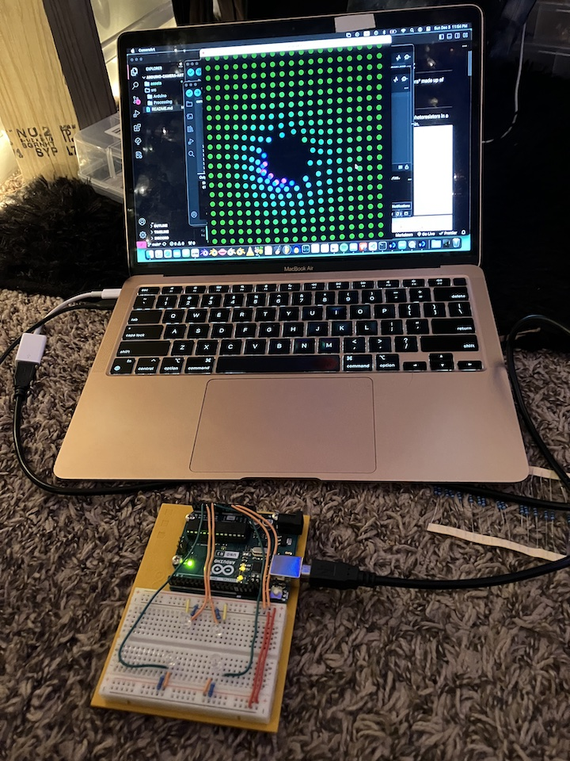
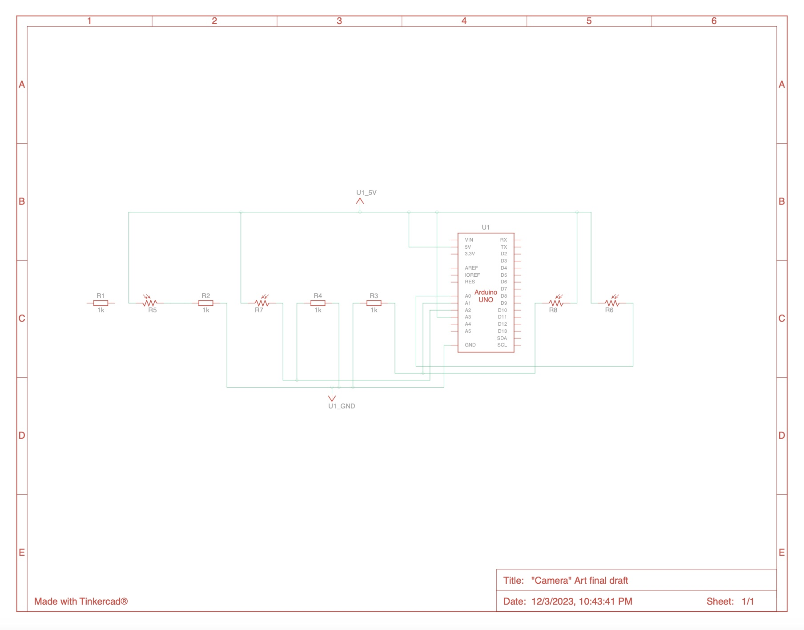
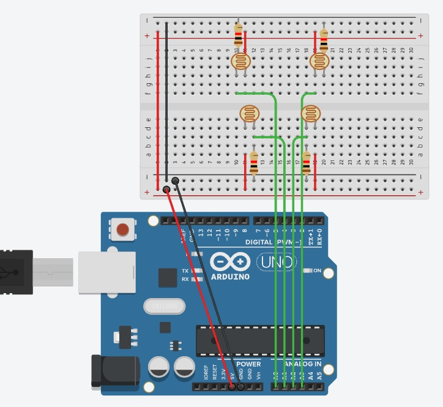
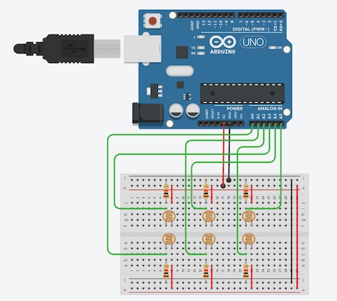
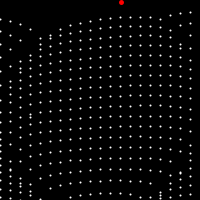
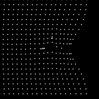
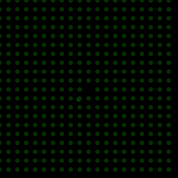
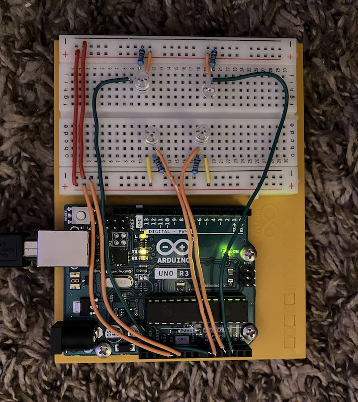

# arduino-camera-art
generative art produced using a "camera" made up of photoresistors.

## Circuit
The electronics are dead simple: four photoresistors in a square, each connected to an analog pin.

### Components:
Part|Quantity
-|-
Arduino Uno|1
1 k&Omega; Resistor|4
Photoresistor|4

## Software
I've divided the software into several components:
- [Data](src/Processing/Data.pde): Reads in and contains the data from the Arduino
- [MotionDetection](src/Processing/MotionDetection.pde): Interprets the data to detect motion over the camera
- [Display](src/Processing/Display.pde): Uses the data to create an art display

## Project Process
### Planning
I started by putting together a rough Tinkercad sketch of my project idea, using the spec sheet for the photoresistors for help:

### Building
I started by building the basic circuit and setting up the basic Arduino and Processing files for reading serial data.

### Coding
After the Arduino and Processing were connected, I started to work on setting up the motion detection. 

Once I felt good about the settings, I started to work on the display.

I put together a basic physics setup for the grid of dots so I could move them around and spring them back into place:

I set up a simulation of the motion data and started to set up the display to work with it:

### Final Touches
I tweaked the display and added more details and connected the real Arduino to create the final art piece:

### Cleaning up the circuit
I trimmed all the leads and finished out the circuit: 

## Resources
### Similar To:
- [Arduino - 06 Light Theremin](https://www.youtube.com/watch?v=DnD92Q_Kpac)

### Info Sources
- [Visualization with Arduino and Processing](https://www.arduino.cc/education/visualization-with-arduino-and-processing/)
- [Processing Language Reference](https://processing.org/reference/)

### Spec Sheets
- [Photoresistor](https://wiki-content.arduino.cc/documents/datasheets/HW5P-1.pdf)